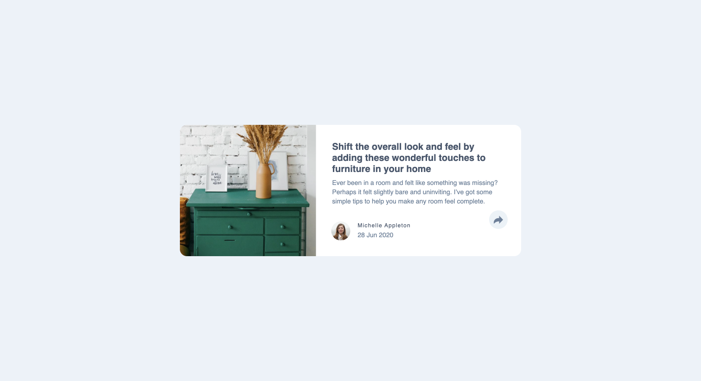
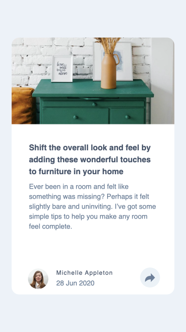
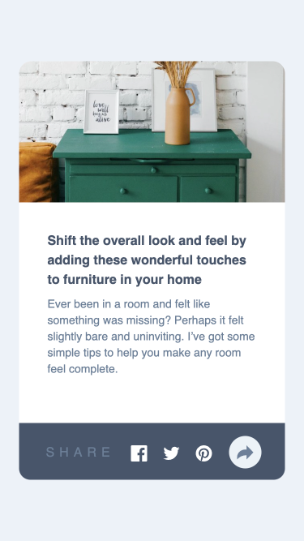

# Frontend Mentor - Article preview component solution

This is a solution to the [Article preview component challenge on Frontend Mentor](https://www.frontendmentor.io/challenges/article-preview-component-dYBN_pYFT). Frontend Mentor challenges help you improve your coding skills by building realistic projects. 

## Table of contents

- [Overview](#overview)
  - [The challenge](#the-challenge)
  - [Screenshot](#screenshot)
  - [Links](#links)
- [My process](#my-process)
  - [Built with](#built-with)
  - [What I learned](#what-i-learned)
  - [Continued development](#continued-development)
  - [Useful resources](#useful-resources)
- [Author](#author)
- [Acknowledgments](#acknowledgments)

**Note: Delete this note and update the table of contents based on what sections you keep.**

## Overview

### The challenge

Users should be able to:

- View the optimal layout for the component depending on their device's screen size
- See the social media share links when they click the share icon

### Screenshot

### Links

- Solution URL: [[Add solution URL here](https://github.com/nonoza/frontendmentor/tree/main/article-preview-component-master)](https://github.com/nonoza/frontendmentor/tree/main/article-preview-component-master)
- Live Site URL: [[Add live site URL here](https://nonoza.github.io/frontendmentor/article-preview-component-master)](https://nonoza.github.io/frontendmentor/article-preview-component-master/)

## My process

### Built with

- Semantic HTML5 markup
- CSS custom properties
- Flexbox
- Javascript

## Author

- Website - [Add your name here](https://prettynkunene.co.za/)
- Frontend Mentor - [@yourusername](https://www.frontendmentor.io/profile/nonoza)

