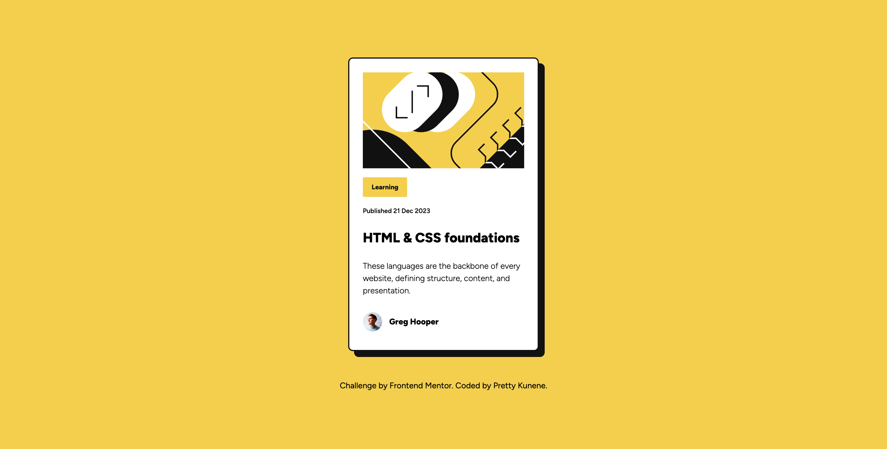
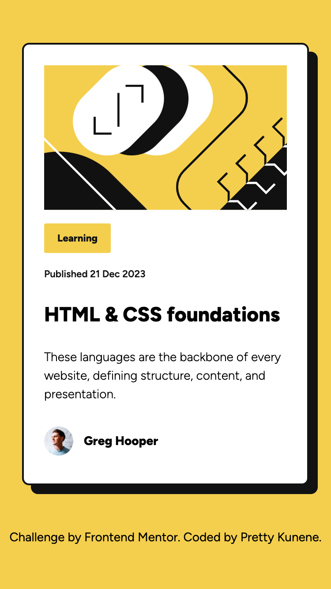

# Frontend Mentor - Blog preview card solution

This is a solution to the [Blog preview card challenge on Frontend Mentor](https://www.frontendmentor.io/challenges/blog-preview-card-ckPaj01IcS). Frontend Mentor challenges help you improve your coding skills by building realistic projects. 

## Table of contents

- [Overview](#overview)
  - [The challenge](#the-challenge)
  - [Screenshot](#screenshot)
  - [Links](#links)
- [My process](#my-process)
  - [Built with](#built-with)
  - [What I learned](#what-i-learned)
  - [Continued development](#continued-development)
  - [Useful resources](#useful-resources)
- [Author](#author)
- [Acknowledgments](#acknowledgments)

### Screenshot

### Links

- Solution URL: [[Add solution URL here](https://github.com/nonoza/frontendmentor/tree/main/blog-preview-card-main)](https://github.com/nonoza/frontendmentor/tree/main/blog-preview-card-main)
- Live Site URL: [Add live site URL here](https://your-live-site-url.com)

### Built with

- Semantic HTML5 markup
- Mobile-first workflow
- [TailwindCSS](https://tailwindcss.com/) - Tailwind CSS

## Author

- Website - [Pretty Kunene](https://prettynkunene.co.za/)
- Frontend Mentor - [@nonoza](https://www.frontendmentor.io/profile/nonoza)

