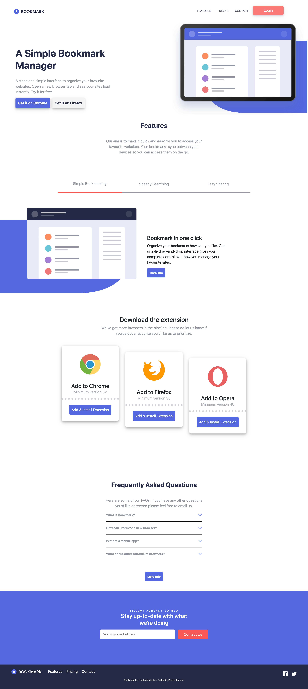
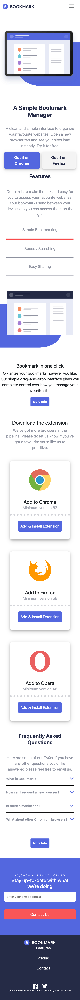

# Frontend Mentor - Bookmark landing page solution

This is a solution to the [Bookmark landing page challenge on Frontend Mentor](https://www.frontendmentor.io/challenges/bookmark-landing-page-5d0b588a9edda32581d29158). Frontend Mentor challenges help you improve your coding skills by building realistic projects. 

## Table of contents

- [Overview](#overview)
  - [The challenge](#the-challenge)
  - [Screenshot](#screenshot)
  - [Links](#links)
- [My process](#my-process)
  - [Built with](#built-with)
  - [What I learned](#what-i-learned)
  - [Continued development](#continued-development)
  - [Useful resources](#useful-resources)
- [Author](#author)
- [Acknowledgments](#acknowledgments)

## Overview

### The challenge

Users should be able to:

- View the optimal layout for the site depending on their device's screen size
- See hover states for all interactive elements on the page
- Receive an error message when the newsletter form is submitted if:
  - The input field is empty
  - The email address is not formatted correctly

### Screenshot

### Deskop

### Mobile

### Links

- Solution URL: [https://github.com/nonoza/frontendmentor/tree/main/bookmark-landing-page-master](https://github.com/nonoza/frontendmentor/tree/main/bookmark-landing-page-master)
- Live Site URL: [https://nonoza.github.io/frontendmentor/bookmark-landing-page-master/](https://nonoza.github.io/frontendmentor/bookmark-landing-page-master/)

## My process

### Built with

- Semantic HTML5 markup
- CSS custom properties
- Flexbox
- CSS Grid
- Mobile-first workflow
- sass

### Continued development

- I will continuosly upskill my sass and javascript skills.
- Prepare the website document
- Make sure that sass standards aew applied and indent is 2 space.

## Author

- Website - [Pretty Kunene](https://prettynkunene.co.za/)
- Frontend Mentor - [@nonoza](https://www.frontendmentor.io/profile/nonoza)

