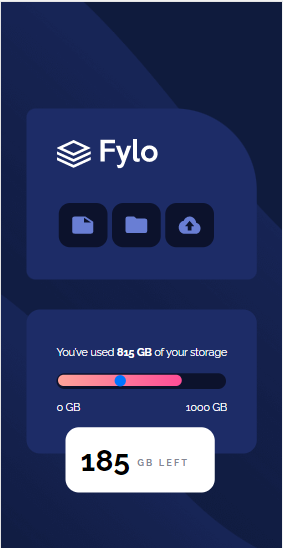

# Frontend Mentor - Fylo data storage component solution

This is a solution to the [Fylo data storage component challenge on Frontend Mentor](https://www.frontendmentor.io/challenges/fylo-data-storage-component-1dZPRbV5n). Frontend Mentor challenges help you improve your coding skills by building realistic projects. 

## Table of contents

- [Overview](#overview)
  - [The challenge](#the-challenge)
  - [Screenshot](#screenshot)
  - [Links](#links)
- [My process](#my-process)
  - [Built with](#built-with)
  - [What I learned](#what-i-learned)
  - [Continued development](#continued-development)
  - [Useful resources](#useful-resources)
- [Author](#author)
- [Acknowledgments](#acknowledgments)

## Overview

### The challenge

Users should be able to:

- View the optimal layout for the site depending on their device's screen size

### Screenshot

### Links

- Solution URL: [Add solution URL here](https://your-solution-url.com)
- Live Site URL: [Add live site URL here](https://your-live-site-url.com)

## My process
- HTML STRUCTURE
- USED VANILLA CSS TO STYLE THE PAGE

### Built with

- Semantic HTML5 markup
- Vanilla CSS
- Flexbox
- CSS Grid
- Mobile-first workflow

### What I learned

This was a simple and straight project. I was a first time using an input type of range .
 So I learned how to style it using one of the 3wSchool and over stake flow.

### Useful resources

- [W3 School](https://www.w3schools.com/howto/howto_js_rangeslider.asp) - This has helped me on how to style the input Range.

## Author

- Website - [Pretty Kunene](https://prettynkunene.co.za/)
- Frontend Mentor - [@nonoza](https://www.frontendmentor.io/profile/yourusername)

